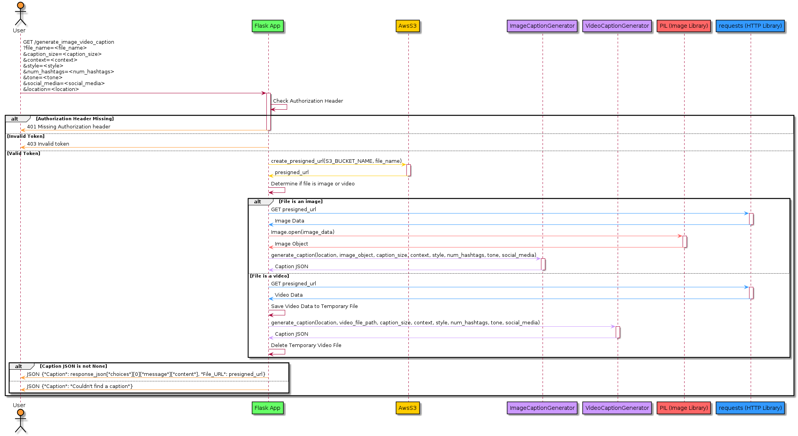
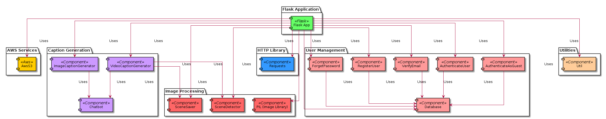
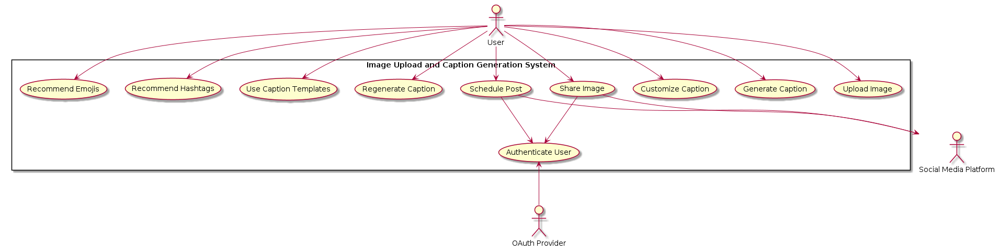

# I2C_Arch

I2C Complete Architecture.
This architectural document will contain software and system architectures.

[View Architecture Documentation](docs/software_arch.pdf)
[View Benchmarking Documentation](docs/blip2_benchmarking.pdf)

## Sequence Diagram

## Component Diagram

## Usecase Diagram
